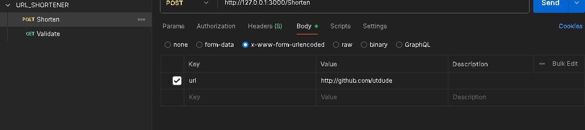

# 🔗 URL Shortener API

A lightweight RESTful API built with Node.js, Express, and MongoDB that shortens long URLs and provides redirection functionality using a generated short code.


---

## 🧰 Tech Stack

- **Language**: JavaScript
- **Runtime**: Node.js
- **Framework**: Express.js
- **Database**: MongoDB (via Mongoose)

---

## 🚀 API Endpoints

### ✅ `POST /Shorten`

Create a short URL for a given long URL.

**Request Body (JSON):**
```json
{
  "url": "https://example.com/some/very/long/link"
}
```

**Success Response:**
```json
{
  "originalUrl": "https://example.com/some/very/long/link",
  "shortUrl": "https://short.ly/abc123"
}
```

---

### ✅ `GET /short.ly/:code`

Redirects to the original long URL.

**Example Request:**
```
GET http://127.0.0.1:3000/short.ly/abc123
```

**Action:**
- Redirects (HTTP 301) to the original URL
- 
- Returns `404` if code is not found or expired
- 

---


## 📦 Setup Instructions

### 1. Clone the Repository
```bash
git clone https://github.com/utdude/Url_Shortener.git
```

### 2. Install Dependencies
```bash
npm install
```

### 3. Configure Environment Variables

Create a `.env` file:
```
PORT=3000
CONN_URL= "YOUR MONGO ATLAS CONNECTION STRING"
```

### 4. Run the Server
```bash
node App.js
```

---

## 🧪 API Usage

- Add url as parameter in Shorten Route and make a **POST** request. - *http://127.0.0.1:3000/Shorten*
- Use the generated short url as the route to get **REDIRECTED** in **GET** request. - *http://127.0.0.1:3000/short.ly/00dff0* 


---
## 🧪 Postman Testing Collection

- **[Click Here - Postman Collection Link](https://www.postman.com/joint-operations-astronomer-56491108/url-shortener/collection/f37zooa/url-shortener?action=share&creator=37121678)**

*Postman Shorten/ Route*

*Postman Validation Route*


---

## 👨‍💻 Author

**Utkarsh Rai**  
GitHub: [@utdude](https://github.com/utdude)

---
